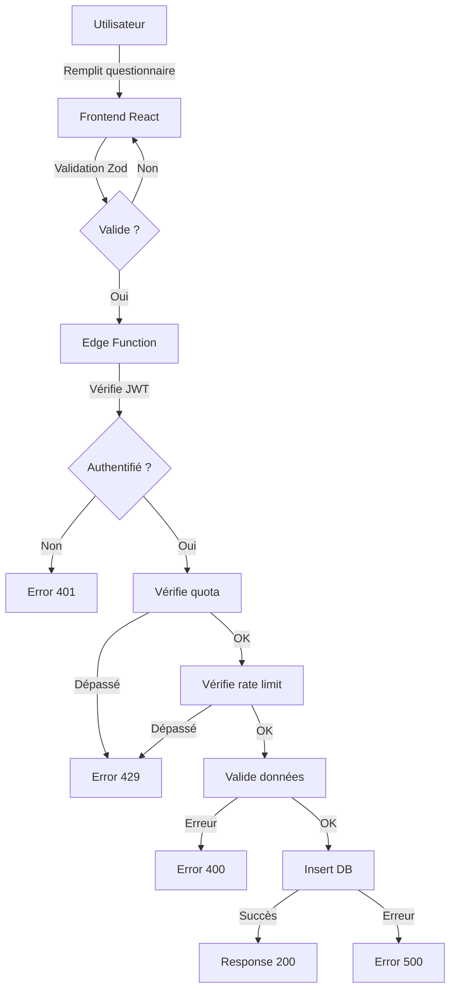

# 📋 DOCUMENTATION COMPLÈTE DU QUESTIONNAIRE TRAVLIAQ

**Version:** 2.0  
**Date:** 19 octobre 2025  
**Type:** Documentation technique et métier complète

---

## TABLE DES MATIÈRES

1. [Vue d'ensemble](#vue-densemble)
2. [Architecture technique](#architecture-technique)
3. [Logique conditionnelle complète](#logique-conditionnelle-complète)
4. [Catalogue exhaustif des questions](#catalogue-exhaustif-des-questions)
5. [Système de valeurs internes](#système-de-valeurs-internes)
6. [JSON Schema complet](#json-schema-complet)
7. [Base de données](#base-de-données)
8. [Validation et sécurité](#validation-et-sécurité)
9. [Exemples d'usage](#exemples-dusage)
10. [Debugging et maintenance](#debugging-et-maintenance)

---

## VUE D'ENSEMBLE

### Principe de fonctionnement

Le questionnaire Travliaq est un **système de collecte de données adaptatif** qui :
- S'adapte dynamiquement aux réponses de l'utilisateur
- Varie de **10 à 25+ étapes** selon les réponses
- Utilise un **système de codes internes** indépendant de la langue
- Stocke les données en **JSON normalisé** dans PostgreSQL
- Applique une **double validation** (frontend + backend)

### Caractéristiques clés

| Caractéristique | Description |
|----------------|-------------|
| **Authentification** | Obligatoire via JWT Supabase |
| **Quota** | 2 soumissions / utilisateur / 24h |
| **Rate limiting** | 3 requêtes / minute / IP |
| **Langues supportées** | FR / EN (détection automatique) |
| **Type de validation** | Frontend (Zod) + Backend (Edge Function) |
| **Stockage** | Table `questionnaire_responses` (PostgreSQL) |

---

## ARCHITECTURE TECHNIQUE

### Stack technologique

```
Frontend (React + TypeScript)
    ├── React Hook Form (gestion formulaire)
    ├── Zod (validation schema)
    ├── i18next (internationalisation)
    └── React Router (navigation)
            ↓
Edge Function (Deno)
    ├── Validation serveur
    ├── Rate limiting
    ├── Quota check
    └── JWT verification
            ↓
Database (PostgreSQL/Supabase)
    ├── Table: questionnaire_responses
    ├── RLS Policies (Row Level Security)
    └── Trigger: update_questionnaire_updated_at
```

### Flux de données



---

## LOGIQUE CONDITIONNELLE COMPLÈTE

### Calcul dynamique du nombre d'étapes

Le nombre total d'étapes se calcule ainsi :

```typescript
function getTotalSteps() {
  let count = 10; // Étapes toujours affichées (base)
  
  // +1 si Famille ou Groupe 3-5 (détails voyageurs)
  const normalizedGroup = normalizeTravelGroup(answers.travelGroup);
  if (normalizedGroup === 'family' || normalizedGroup === 'group35') {
    count++;
  }
  
  // Si destination précise (Oui) : +1
  // Si pas de destination (Non) : +4 (climat, affinités, ambiance, ville départ)
  if (normalizeYesNo(answers.hasDestination) === 'yes') {
    count++;
  } else if (normalizeYesNo(answers.hasDestination) === 'no') {
    count += 4;
  }
  
  // +1 si budget précis sélectionné
  if (answers.budgetType === 'Budget total précis') {
    count++;
  }
  
  // Si "Activités" sélectionnées
  if (answers.helpWith?.includes('activities')) {
    // +1 pour rythme
    count++;
    // +1 pour style (uniquement si destination précise)
    if (normalizeYesNo(answers.hasDestination) === 'yes') {
      count++;
    }
    // +1 pour horloge biologique
    count++;
  }
  
  // +2 si "Vols" sélectionnés (préférence vol + bagages)
  if (answers.helpWith?.includes('flights')) {
    count += 2;
  }
  
  // +5 si "Hébergement" sélectionné
  if (answers.helpWith?.includes('accommodation')) {
    count += 5; // type, préférences hôtel (si hôtel), confort, quartier, équipements
  }
  
  // +1 si "Hébergement" OU "Activités" sélectionnés (sécurité)
  if (answers.helpWith?.includes('accommodation') || answers.helpWith?.includes('activities')) {
    count++;
  }
  
  return count;
}
```

### Arbre de décision complet

```
START
│
├─ [1] Qui voyage ? (TOUJOURS)
│   ├─ Solo ──────────────────────────────> Passer à [2]
│   ├─ Duo ───────────────────────────────> Passer à [2]
│   ├─ Groupe 3-5 ─────────────────────┐
│   └─ Famille ─────────────────────┐   │
│                                    │   │
│   ┌────────────────────────────────┘   │
│   │ [1b] Détails voyageurs (ADULTES + ENFANTS)
│   └────────────────────────────────────┘
│
├─ [2] Destination en tête ? (TOUJOURS)
│   ├─ Oui ──────────────────────────┐
│   └─ Non ──────────────────────┐   │
│                                │   │
│   ┌────────────────────────────┘   │
│   │ [2d] Climat préféré            │
│   │ [2e] Affinités voyage (max 5)  │
│   │ [2f] Ambiance recherchée       │
│   │ [2g] Ville de départ           │
│   └────────────────────────────┐   │
│                                │   │
│   ┌────────────────────────────┘   │
│   │ [2c] Destination précise       │
│   │      + Ville de départ         │
│   └────────────────────────────────┘
│
├─ [2b] Comment Travliaq peut aider ? (TOUJOURS)
│   ├─ ✓ Vols ──────────────────────┐
│   ├─ ✓ Hébergement ────────────┐  │
│   └─ ✓ Activités ───────────┐  │  │
│                              │  │  │
│   ┌──────────────────────────┘  │  │
│   │ [6] Style (max 5)           │  │
│   │     (SI destination précise)│  │
│   │ [7] Rythme                  │  │
│   │ [16] Horloge biologique     │  │
│   └─────────────────────────────┘  │
│                                    │
│   ┌────────────────────────────────┘
│   │ [11] Type hébergement (max 2)
│   │ [11b] Préférences hôtel (SI hôtel sélectionné)
│   │ [12] Confort minimum
│   │ [13] Quartier
│   │ [14] Équipements
│   └────────────────────────────────┐
│                                    │
│   ┌────────────────────────────────┘
│   │ [8] Préférence vol             │
│   │ [9] Bagages par voyageur       │
│   └────────────────────────────────┘
│
│   ┌────────────────────────────────────────┐
│   │ [15] Sécurité & Phobies                │
│   │      (SI Hébergement OU Activités)     │
│   └────────────────────────────────────────┘
│
├─ [3] Type de dates (TOUJOURS)
│   ├─ Dates précises ──────────────┐
│   ├─ Dates flexibles ──────────┐  │
│   └─ Pas de dates              │  │
│                                │  │
│   ┌────────────────────────────┘  │
│   │ [3b] Sélecteur dates          │
│   │      (départ + retour)        │
│   └───────────────────────────┐   │
│                               │   │
│   ┌───────────────────────────┘   │
│   │ [3c] Flexibilité              │
│   │ [3d] Date approx ? (Oui/Non)  │
│   │      ├─ [3e] Date approx      │
│   │ [4] Durée séjour              │
│   │      ├─ Si "Plus de 2 sem"    │
│   │      └─ [4b] Nombre nuits     │
│   └───────────────────────────────┘
│
├─ [10] Mobilité sur place (TOUJOURS)
│     (SAUF si uniquement "Vols" sélectionnés)
│
├─ [5] Budget (TOUJOURS)
│   ├─ Type ? ─────────────────────┐
│   │   ├─ Estimation par jour     │
│   │   └─ Budget total précis ────┤
│   │                              │
│   ┌──────────────────────────────┘
│   │ [5b] Montant exact
│   │ [5c] Devise
│   └──────────────────────────────┘
│
├─ [17] Contraintes (TOUJOURS)
│
├─ [18] Zone ouverte (TOUJOURS)
│
└─ [19] Email (TOUJOURS)
         ↓
       ENVOI
```

---

## CATALOGUE EXHAUSTIF DES QUESTIONS

### Questions toujours affichées (10 questions base)

| # | Question | Type | Valeurs possibles | Stockage DB |
|---|----------|------|-------------------|-------------|
| 1 | Qui voyage ? | Single choice | `solo`, `duo`, `group35`, `family` | `travel_group` |
| 2 | Destination en tête ? | Single choice | `yes`, `no` | `has_destination` |
| 2b | Comment Travliaq peut aider ? | Multi-choice | `flights`, `accommodation`, `activities` | `help_with` |
| 3 | Type de dates | Single choice | `fixed`, `flexible`, `no_dates` | `dates_type` |
| 5 | Budget | Single choice | Labels traduits | `budget` |
| 10 | Mobilité sur place | Multi-choice | Labels traduits | `mobility` |
| 17 | Contraintes | Multi-choice | Labels traduits | `constraints` |
| 18 | Zone ouverte | Textarea | Texte libre | `additional_info` |
| 19 | Email | Email input | Format email | `email` |
| (auto) | Langue | Auto-détecté | `fr`, `en` | `language` |

### Questions conditionnelles

#### Branche 1 : Détails voyageurs (+1 question)

**Condition :** `travel_group` = `family` OU `group35`

| # | Question | Type | Description | Stockage DB |
|---|----------|------|-------------|-------------|
| 1b | Détails voyageurs | Complex | Nombre d'adultes + nombre d'enfants avec âges | `travelers`, `number_of_travelers`, `children` |

**Format données :**
```json
{
  "travelers": [
    { "type": "adult" },
    { "type": "adult" },
    { "type": "child", "age": 8 },
    { "type": "child", "age": 12 }
  ],
  "number_of_travelers": 4,
  "children": [
    { "age": 8 },
    { "age": 12 }
  ]
}
```

#### Branche 2 : Destination précise (+1 question)

**Condition :** `has_destination` = `yes`

| # | Question | Type | Description | Stockage DB |
|---|----------|------|-------------|-------------|
| 2c | Destination précise | City search | Ville, Pays 🇫🇷 | `destination` |
| 2c | Ville de départ | City search | Ville, Pays 🇫🇷 | `departure_location` |

**Autocomplétion :** 500+ villes majeures avec normalisation d'accents

#### Branche 3 : Pas de destination (+4 questions)

**Condition :** `has_destination` = `no`

| # | Question | Type | Description | Stockage DB |
|---|----------|------|-------------|-------------|
| 2d | Climat préféré | Multi-choice | Max 6 choix | `climate_preference` |
| 2e | Affinités voyage | Multi-choice | Max 5 choix | `travel_affinities` |
| 2f | Ambiance recherchée | Single choice | Type d'atmosphère | `travel_ambiance` |
| 2g | Ville de départ | City search | Avec géolocalisation | `departure_location` |

#### Branche 4A : Dates précises (+1 question)

**Condition :** `dates_type` = `fixed`

| # | Question | Type | Description | Stockage DB |
|---|----------|------|-------------|-------------|
| 3b | Dates précises | Date range picker | Départ + Retour | `departure_date`, `return_date` |

#### Branche 4B : Dates flexibles (+3 à 5 questions)

**Condition :** `dates_type` = `flexible`

| # | Question | Type | Description | Stockage DB |
|---|----------|------|-------------|-------------|
| 3c | Flexibilité | Single choice | ±1 jour, ±2-3 jours, etc. | `flexibility` |
| 3d | Date approx ? | Yes/No | A une période en tête | `has_approximate_departure_date` |
| 3e | Date approximative | Date picker | Si Oui à 3d | `approximate_departure_date` |
| 4 | Durée séjour | Single choice | Week-end, 1 sem, 2 sem, etc. | `duration` |
| 4b | Nombre nuits exact | Number input | Si "Plus de 2 semaines" | `exact_nights` |

#### Branche 5 : Budget précis (+2 questions)

**Condition :** `budget_type` = "Budget total précis"

| # | Question | Type | Description | Stockage DB |
|---|----------|------|-------------|-------------|
| 5b | Montant exact | Number input | Budget total | `budget_amount` |
| 5c | Devise | Dropdown | EUR, USD, GBP, CHF, CAD, AUD | `budget_currency` |

#### Branche 6A : Activités (+2 à 3 questions)

**Condition :** `activities` IN `help_with`

| # | Question | Type | Description | Stockage DB |
|---|----------|------|-------------|-------------|
| 6 | Style | Multi-choice (max 5) | SI destination précise | `styles` |
| 7 | Rythme | Single choice | `relaxed`, `balanced`, `intense` | `rhythm` |
| 16 | Horloge biologique | Multi-choice | Préférences horaires | `schedule_prefs` |

**Valeurs internes rhythm :**
- `relaxed` : Tranquille
- `balanced` : Équilibré
- `intense` : Intense

**Valeurs internes schedule_prefs :**
- `early_bird` : Lève-tôt
- `night_owl` : Couche-tard
- `needs_siesta` : Besoin siestes
- `needs_breaks` : Besoin pauses
- `needs_free_time` : Besoin temps libre
- `flexible_schedule` : Horaires flexibles

#### Branche 6B : Vols (+2 questions)

**Condition :** `flights` IN `help_with`

| # | Question | Type | Description | Stockage DB |
|---|----------|------|-------------|-------------|
| 8 | Préférence vol | Single choice | Direct, 1 escale, peu importe | `flight_preference` |
| 9 | Bagages | Object | Par voyageur | `luggage` |

**Format luggage :**
```json
{
  "0": "Bagage cabine uniquement",
  "1": "1 bagage en soute",
  "2": "Bagage cabine uniquement"
}
```

Options bagages :
- `"Objet personnel"` : Sous le siège
- `"Bagage cabine uniquement"` : Compartiment supérieur
- `"Cabine + 1 bagage soute"` : Cabine + soute

#### Branche 6C : Hébergement (+4 à 5 questions)

**Condition :** `accommodation` IN `help_with`

| # | Question | Type | Description | Stockage DB |
|---|----------|------|-------------|-------------|
| 11 | Type hébergement | Multi-choice (max 2) | Hôtel, Airbnb, etc. | `accommodation_type` |
| 11b | Préférences hôtel | Multi-choice | SI "Hôtel" sélectionné | `hotel_preferences` |
| 12 | Confort minimum | Single choice | Basique, Standard, Supérieur, Luxe | `comfort` |
| 13 | Quartier | Single choice | Centre, Calme, Authentique, etc. | `neighborhood` |
| 14 | Équipements | Multi-choice | WiFi, Piscine, Clim, etc. | `amenities` |

**Valeurs internes hotel_preferences :**
- `all_inclusive` : All-inclusive
- `half_board` : Demi-pension
- `breakfast_only` : Petit-déjeuner uniquement
- `nothing` : Rien (je gère mes repas)

#### Branche 6D : Sécurité (+1 question)

**Condition :** `accommodation` IN `help_with` OU `activities` IN `help_with`

| # | Question | Type | Description | Stockage DB |
|---|----------|------|-------------|-------------|
| 15 | Sécurité & Phobies | Multi-choice | Contraintes spécifiques | `security` |

---

## SYSTÈME DE VALEURS INTERNES

### Principe

Le questionnaire utilise un **système de codes internes** qui :
- Sont **indépendants de la langue** (jamais traduits)
- Sont **stockés en base de données**
- Sont **normalisés** avant stockage
- Permettent la **compatibilité multilingue**

### Fichier de référence : `src/lib/questionnaireValues.ts`

```typescript
// Codes internes (JAMAIS traduits)
export const TRAVEL_GROUPS = {
  SOLO: 'solo',
  DUO: 'duo',
  GROUP35: 'group35',
  FAMILY: 'family'
} as const;

export const YES_NO = {
  YES: 'yes',
  NO: 'no'
} as const;

export const DATES_TYPE = {
  FIXED: 'fixed',
  FLEXIBLE: 'flexible'
} as const;

export const HELP_WITH = {
  FLIGHTS: 'flights',
  ACCOMMODATION: 'accommodation',
  ACTIVITIES: 'activities'
} as const;
```

### Fonctions de normalisation

```typescript
// Normalise les valeurs traduites vers codes internes
export const normalizeTravelGroup = (value: string | undefined): string | undefined => {
  if (!value) return undefined;
  const lowerValue = value.toLowerCase().trim();
  
  // Si déjà un code interne
  if (['solo', 'duo', 'group35', 'family'].includes(lowerValue)) {
    return lowerValue;
  }
  
  // Détection depuis labels traduits
  if (lowerValue === 'groupe 3-5' || lowerValue === 'group 3-5') return 'group35';
  if (lowerValue.includes('famille') || lowerValue.includes('family')) return 'family';
  
  return lowerValue;
};
```

### Mapping complet des codes

| Champ DB | Code interne | Label FR | Label EN |
|----------|--------------|----------|----------|
| `travel_group` | `solo` | Solo | Solo |
| `travel_group` | `duo` | Duo | Duo |
| `travel_group` | `group35` | Groupe 3-5 | Group 3-5 |
| `travel_group` | `family` | Famille | Family |
| `has_destination` | `yes` | Oui | Yes |
| `has_destination` | `no` | Non | No |
| `dates_type` | `fixed` | Dates précises | Fixed dates |
| `dates_type` | `flexible` | Dates flexibles | Flexible dates |
| `help_with[]` | `flights` | Vols | Flights |
| `help_with[]` | `accommodation` | Hébergement | Accommodation |
| `help_with[]` | `activities` | Activités | Activities |
| `rhythm` | `relaxed` | Tranquille | Relaxed |
| `rhythm` | `balanced` | Équilibré | Balanced |
| `rhythm` | `intense` | Intense | Intense |
| `schedule_prefs[]` | `early_bird` | Lève-tôt | Early bird |
| `schedule_prefs[]` | `night_owl` | Couche-tard | Night owl |
| `schedule_prefs[]` | `needs_siesta` | Besoin siestes | Needs siesta |
| `schedule_prefs[]` | `needs_breaks` | Besoin pauses | Needs breaks |
| `schedule_prefs[]` | `needs_free_time` | Besoin temps libre | Needs free time |
| `schedule_prefs[]` | `flexible_schedule` | Horaires flexibles | Flexible schedule |
| `hotel_preferences[]` | `all_inclusive` | All-inclusive | All-inclusive |
| `hotel_preferences[]` | `half_board` | Demi-pension | Half-board |
| `hotel_preferences[]` | `breakfast_only` | Petit-déjeuner uniquement | Breakfast only |
| `hotel_preferences[]` | `nothing` | Rien | Nothing |

### Champs avec labels traduits (PAS de codes internes)

Ces champs stockent les **labels traduits** directement :
- `budget` (ex: "Économique (< 50€/jour)")
- `styles` (ex: "Culture & Histoire 🏛️")
- `mobility` (ex: "Transports en commun 🚇")
- `accommodation_type` (ex: "Hôtel 🏨")
- `amenities` (ex: "WiFi 📶")
- `security` (ex: "Éviter foule/espaces bondés 👥")
- `constraints` (ex: "Végétarien/Vegan 🌱")
- `climate_preference` (ex: "Chaud et ensoleillé ☀️")
- `travel_affinities` (ex: "Plages & Détente 🏖️")
- `travel_ambiance` (ex: "Mix des deux 🎭")
- `flexibility` (ex: "±1 semaine")
- `duration` (ex: "1 semaine (4-7 jours)")
- `flight_preference` (ex: "Direct uniquement")
- `comfort` (ex: "Standard (confortable)")
- `neighborhood` (ex: "Centre-ville (accès facile)")

---

## JSON SCHEMA COMPLET

### Structure de l'objet Answer (frontend)

```typescript
interface Traveler {
  type: 'adult' | 'child';
  age?: number; // Requis si type = 'child'
}

type Answer = {
  // === PROFIL VOYAGEUR ===
  travelGroup?: string;              // Code interne: 'solo' | 'duo' | 'group35' | 'family'
  numberOfTravelers?: number;        // Nombre total
  travelers?: Traveler[];            // Système unifié
  children?: Array<{ age: number }>; // Ancien système (compatibilité)
  
  // === DESTINATION ===
  hasDestination?: string;           // Code interne: 'yes' | 'no'
  destination?: string;              // "Ville, Pays 🇫🇷"
  departureLocation?: string;        // "Ville, Pays 🇫🇷"
  climatePreference?: string[];      // Labels traduits
  travelAffinities?: string[];       // Labels traduits (max 5)
  travelAmbiance?: string;           // Label traduit
  
  // === SERVICES ===
  helpWith?: string[];               // Codes internes: ['flights', 'accommodation', 'activities']
  
  // === DATES ===
  datesType?: string;                      // Code interne: 'fixed' | 'flexible'
  departureDate?: string;                  // ISO 8601: "YYYY-MM-DD"
  returnDate?: string;                     // ISO 8601: "YYYY-MM-DD"
  flexibility?: string;                    // Label traduit
  hasApproximateDepartureDate?: string;    // 'Oui' | 'Non' (label)
  approximateDepartureDate?: string;       // ISO 8601: "YYYY-MM-DD"
  duration?: string;                       // Label traduit
  exactNights?: number;                    // 1-365
  
  // === BUDGET ===
  budget?: string;                   // Label traduit
  budgetType?: string;               // Label traduit
  budgetAmount?: number;             // 0-10,000,000
  budgetCurrency?: string;           // 'EUR' | 'USD' | 'GBP' | 'CHF' | 'CAD' | 'AUD'
  
  // === STYLE & RYTHME ===
  styles?: string[];                 // Labels traduits (max 5)
  rhythm?: string;                   // Code interne: 'relaxed' | 'balanced' | 'intense'
  schedulePrefs?: string[];          // Codes internes (schedule_prefs)
  
  // === TRANSPORT ===
  flightPreference?: string;         // Label traduit
  luggage?: { [travelerIndex: number]: string }; // Object { "0": "label", "1": "label" }
  mobility?: string[];               // Labels traduits
  
  // === HÉBERGEMENT ===
  accommodationType?: string[];      // Labels traduits (max 2)
  hotelPreferences?: string[];       // Codes internes (hotel_preferences)
  comfort?: string;                  // Label traduit
  neighborhood?: string;             // Label traduit
  amenities?: string[];              // Labels traduits
  
  // === CONTRAINTES ===
  security?: string[];               // Labels traduits
  constraints?: string[];            // Labels traduits
  
  // === INFORMATIONS ===
  additionalInfo?: string;           // Texte libre (max 2000 chars)
  email?: string;                    // Format email
};
```

### Exemple JSON complet (famille à Tokyo)

```json
{
  "user_id": "550e8400-e29b-41d4-a716-446655440000",
  "email": "famille.dupont@example.com",
  "language": "fr",
  
  "travel_group": "family",
  "number_of_travelers": 4,
  "travelers": [
    { "type": "adult" },
    { "type": "adult" },
    { "type": "child", "age": 8 },
    { "type": "child", "age": 12 }
  ],
  "children": [
    { "age": 8 },
    { "age": 12 }
  ],
  
  "has_destination": "yes",
  "destination": "Tokyo, Japon 🇯🇵",
  "departure_location": "Paris, France 🇫🇷",
  "climate_preference": null,
  "travel_affinities": null,
  "travel_ambiance": null,
  
  "help_with": ["flights", "accommodation", "activities"],
  
  "dates_type": "fixed",
  "departure_date": "2025-07-15",
  "return_date": "2025-07-29",
  "flexibility": null,
  "has_approximate_departure_date": null,
  "approximate_departure_date": null,
  "duration": "2 semaines",
  "exact_nights": 14,
  
  "budget": "Confortable (100-200€/jour)",
  "budget_type": "Budget total précis",
  "budget_amount": 8000,
  "budget_currency": "EUR",
  
  "styles": [
    "Culture & Histoire 🏛️",
    "Gastronomie 🍽️",
    "Nature & Paysages 🏞️"
  ],
  "rhythm": "balanced",
  "schedule_prefs": ["early_bird", "needs_breaks"],
  
  "flight_preference": "1 escale maximum",
  "luggage": {
    "0": "Cabine + 1 bagage soute",
    "1": "Cabine + 1 bagage soute",
    "2": "Bagage cabine uniquement",
    "3": "Bagage cabine uniquement"
  },
  "mobility": [
    "Transports en commun 🚇",
    "Marche à pied 🚶",
    "Train 🚄"
  ],
  
  "accommodation_type": [
    "Hôtel 🏨",
    "Appartement/Airbnb 🏠"
  ],
  "hotel_preferences": ["breakfast_only"],
  "comfort": "Standard (confortable)",
  "neighborhood": "Quartier authentique/Local",
  "amenities": [
    "WiFi 📶",
    "Climatisation ❄️",
    "Cuisine équipée 🍳",
    "Lave-linge 🧺"
  ],
  
  "security": [
    "Éviter foule/espaces bondés 👥"
  ],
  
  "constraints": [
    "Allergies alimentaires 🥜",
    "Végétarien/Vegan 🌱"
  ],
  
  "additional_info": "C'est notre premier voyage au Japon en famille. Nous aimerions découvrir la culture traditionnelle tout en gardant des activités adaptées aux enfants. Un de nos enfants est végétarien.",
  
  "created_at": "2025-10-19T14:30:00.000Z",
  "updated_at": "2025-10-19T14:30:00.000Z"
}
```

### Exemple JSON complet (solo flexible)

```json
{
  "user_id": "a1b2c3d4-e5f6-4a5b-8c9d-0e1f2a3b4c5d",
  "email": "marie.solo@example.com",
  "language": "en",
  
  "travel_group": "solo",
  "number_of_travelers": 1,
  "travelers": null,
  "children": null,
  
  "has_destination": "no",
  "destination": null,
  "departure_location": "Brussels, Belgium 🇧🇪",
  "climate_preference": [
    "Chaud et ensoleillé ☀️",
    "Tropical 🌴"
  ],
  "travel_affinities": [
    "Plages & Détente 🏖️",
    "Yoga & Bien-être 🧘",
    "Nature & Paysages 🏞️",
    "Rencontres & Échanges 🤝"
  ],
  "travel_ambiance": "Mix des deux 🎭",
  
  "help_with": ["activities"],
  
  "dates_type": "flexible",
  "departure_date": null,
  "return_date": null,
  "flexibility": "Totalement flexible",
  "has_approximate_departure_date": "Oui",
  "approximate_departure_date": "2025-09-01",
  "duration": "10 jours",
  "exact_nights": null,
  
  "budget": "Modéré (50-100€/jour)",
  "budget_type": "Estimation par jour",
  "budget_amount": null,
  "budget_currency": null,
  
  "styles": null,
  "rhythm": "relaxed",
  "schedule_prefs": ["early_bird", "needs_free_time"],
  
  "flight_preference": null,
  "luggage": null,
  "mobility": [
    "Transports en commun 🚇",
    "Marche à pied 🚶",
    "Vélo 🚴"
  ],
  
  "accommodation_type": null,
  "hotel_preferences": null,
  "comfort": null,
  "neighborhood": null,
  "amenities": null,
  
  "security": [],
  
  "constraints": [
    "Végétarien/Vegan 🌱"
  ],
  
  "additional_info": "Je cherche une destination calme pour me ressourcer, idéalement avec des cours de yoga.",
  
  "created_at": "2025-10-19T15:00:00.000Z",
  "updated_at": "2025-10-19T15:00:00.000Z"
}
```

---

## BASE DE DONNÉES

### Table : `questionnaire_responses`

```sql
CREATE TABLE public.questionnaire_responses (
  -- Clés primaires et identification
  id UUID NOT NULL DEFAULT gen_random_uuid() PRIMARY KEY,
  user_id UUID NOT NULL,
  email TEXT NOT NULL CHECK (char_length(email) <= 255),
  language TEXT NOT NULL DEFAULT 'fr',
  
  -- Profil voyageur
  travel_group TEXT,
  number_of_travelers INTEGER CHECK (number_of_travelers >= 1 AND number_of_travelers <= 50),
  children JSONB, -- [{ age: number }]
  
  -- Destination
  has_destination TEXT,
  destination TEXT CHECK (char_length(destination) <= 200),
  departure_location TEXT CHECK (char_length(departure_location) <= 200),
  climate_preference JSONB, -- string[]
  travel_affinities JSONB, -- string[]
  travel_ambiance TEXT,
  
  -- Services
  help_with TEXT[], -- ['flights', 'accommodation', 'activities']
  
  -- Dates
  dates_type TEXT,
  departure_date DATE,
  return_date DATE,
  flexibility TEXT,
  has_approximate_departure_date TEXT,
  approximate_departure_date DATE,
  duration TEXT,
  exact_nights INTEGER CHECK (exact_nights >= 1 AND exact_nights <= 365),
  
  -- Budget
  budget TEXT,
  budget_type TEXT,
  budget_amount NUMERIC CHECK (budget_amount >= 0 AND budget_amount <= 10000000),
  budget_currency TEXT,
  
  -- Style & Rythme
  styles JSONB, -- string[]
  rhythm TEXT, -- 'relaxed' | 'balanced' | 'intense'
  schedule_prefs TEXT[], -- ['early_bird', 'night_owl', ...]
  
  -- Transport
  flight_preference TEXT,
  luggage JSONB, -- { "0": "string", "1": "string" }
  mobility JSONB, -- string[]
  
  -- Hébergement
  accommodation_type JSONB, -- string[]
  hotel_preferences TEXT[], -- ['all_inclusive', 'half_board', ...]
  comfort TEXT,
  neighborhood TEXT,
  amenities JSONB, -- string[]
  
  -- Contraintes
  security JSONB, -- string[]
  biorhythm JSONB, -- Ancien champ (deprecated)
  constraints JSONB, -- string[]
  
  -- Informations
  additional_info TEXT CHECK (char_length(additional_info) <= 2000),
  
  -- Métadonnées
  created_at TIMESTAMP WITH TIME ZONE NOT NULL DEFAULT now(),
  updated_at TIMESTAMP WITH TIME ZONE NOT NULL DEFAULT now()
);

-- Index pour performances
CREATE INDEX idx_questionnaire_user_id ON questionnaire_responses(user_id);
CREATE INDEX idx_questionnaire_email ON questionnaire_responses(email);
CREATE INDEX idx_questionnaire_created_at ON questionnaire_responses(created_at);

-- Trigger pour updated_at automatique
CREATE TRIGGER update_questionnaire_updated_at
  BEFORE UPDATE ON questionnaire_responses
  FOR EACH ROW
  EXECUTE FUNCTION update_questionnaire_updated_at();

-- Row Level Security (RLS)
ALTER TABLE questionnaire_responses ENABLE ROW LEVEL SECURITY;

-- Politique : Les utilisateurs authentifiés peuvent insérer leurs propres réponses
CREATE POLICY "Authenticated users can submit questionnaire"
  ON questionnaire_responses
  FOR INSERT
  TO authenticated
  WITH CHECK (auth.uid() = user_id);

-- Politique : Les utilisateurs peuvent voir leurs propres réponses
CREATE POLICY "Users can view own responses"
  ON questionnaire_responses
  FOR SELECT
  TO authenticated
  USING (auth.uid() = user_id);

-- Politique : Les utilisateurs peuvent mettre à jour leurs propres réponses
CREATE POLICY "Users can update own responses"
  ON questionnaire_responses
  FOR UPDATE
  TO authenticated
  USING (auth.uid() = user_id);
```

### Exemple d'insertion SQL

```sql
INSERT INTO questionnaire_responses (
  user_id,
  email,
  language,
  travel_group,
  number_of_travelers,
  children,
  has_destination,
  destination,
  departure_location,
  help_with,
  dates_type,
  departure_date,
  return_date,
  exact_nights,
  budget,
  budget_type,
  budget_amount,
  budget_currency,
  styles,
  rhythm,
  schedule_prefs,
  flight_preference,
  luggage,
  mobility,
  accommodation_type,
  hotel_preferences,
  comfort,
  neighborhood,
  amenities,
  security,
  constraints,
  additional_info
) VALUES (
  '550e8400-e29b-41d4-a716-446655440000',
  'famille.dupont@example.com',
  'fr',
  'family',
  4,
  '[{"age": 8}, {"age": 12}]'::jsonb,
  'yes',
  'Tokyo, Japon 🇯🇵',
  'Paris, France 🇫🇷',
  ARRAY['flights', 'accommodation', 'activities'],
  'fixed',
  '2025-07-15',
  '2025-07-29',
  14,
  'Confortable (100-200€/jour)',
  'Budget total précis',
  8000,
  'EUR',
  '["Culture & Histoire 🏛️", "Gastronomie 🍽️", "Nature & Paysages 🏞️"]'::jsonb,
  'balanced',
  ARRAY['early_bird', 'needs_breaks'],
  '1 escale maximum',
  '{"0": "Cabine + 1 bagage soute", "1": "Cabine + 1 bagage soute", "2": "Bagage cabine uniquement", "3": "Bagage cabine uniquement"}'::jsonb,
  '["Transports en commun 🚇", "Marche à pied 🚶", "Train 🚄"]'::jsonb,
  '["Hôtel 🏨", "Appartement/Airbnb 🏠"]'::jsonb,
  ARRAY['breakfast_only'],
  'Standard (confortable)',
  'Quartier authentique/Local',
  '["WiFi 📶", "Climatisation ❄️", "Cuisine équipée 🍳", "Lave-linge 🧺"]'::jsonb,
  '["Éviter foule/espaces bondés 👥"]'::jsonb,
  '["Allergies alimentaires 🥜", "Végétarien/Vegan 🌱"]'::jsonb,
  'C''est notre premier voyage au Japon en famille. Nous aimerions découvrir la culture traditionnelle tout en gardant des activités adaptées aux enfants. Un de nos enfants est végétarien.'
);
```

### Requêtes SQL utiles

#### Compter les réponses par destination

```sql
SELECT 
  destination, 
  COUNT(*) as count
FROM questionnaire_responses
WHERE destination IS NOT NULL
GROUP BY destination
ORDER BY count DESC
LIMIT 10;
```

#### Vérifier le quota d'un utilisateur

```sql
SELECT COUNT(*) 
FROM questionnaire_responses
WHERE user_id = '550e8400-e29b-41d4-a716-446655440000'
  AND email = 'user@example.com'
  AND created_at >= NOW() - INTERVAL '24 hours';
```

#### Budget moyen par type de groupe

```sql
SELECT 
  travel_group,
  AVG(budget_amount) as avg_budget,
  COUNT(*) as count
FROM questionnaire_responses
WHERE budget_amount IS NOT NULL
GROUP BY travel_group
ORDER BY count DESC;
```

#### Statistiques des services demandés

```sql
SELECT 
  unnest(help_with) as service,
  COUNT(*) as count
FROM questionnaire_responses
WHERE help_with IS NOT NULL
GROUP BY service
ORDER BY count DESC;
```

---

## VALIDATION ET SÉCURITÉ

### Validation frontend (Zod)

```typescript
const questionnaireSchema = z.object({
  email: z.string().email("Email invalide").max(255),
  travelGroup: z.string().optional(),
  numberOfTravelers: z.number().int().min(1).max(50).optional(),
  budgetAmount: z.number().min(0).max(10000000).optional(),
  exactNights: z.number().int().min(1).max(365).optional(),
  departureDate: z.string().optional(),
  returnDate: z.string().optional(),
  // ... autres champs
});
```

### Edge Function : `submit-questionnaire`

**Chemin :** `supabase/functions/submit-questionnaire/index.ts`

#### Fonctionnalités

1. **Rate limiting** : 3 requêtes/minute/IP
2. **Validation complète** : Email, nombres, dates, longueurs
3. **Authentification** : JWT obligatoire via header `Authorization`
4. **Quota** : 2 soumissions/utilisateur/email/24h
5. **Insertion sécurisée** : Via service_role_key

#### Flux de validation

```typescript
async function handleSubmission(req: Request) {
  // 1. Rate limiting par IP
  if (!checkRateLimit(clientIp)) {
    return error429("Too many requests");
  }
  
  // 2. Parse JSON
  const data = await req.json();
  
  // 3. Validation email
  if (!emailRegex.test(data.email)) {
    return error400("Invalid email");
  }
  
  // 4. Validation nombres
  if (data.budget_amount && (data.budget_amount < 0 || data.budget_amount > 1000000)) {
    return error400("Invalid budget");
  }
  
  // 5. Authentification JWT
  const { user, error } = await supabase.auth.getUser(authHeader);
  if (error || !user) {
    return error401("Authentication required");
  }
  
  // 6. Vérification quota
  const recentCount = await countRecent(user.id, data.email);
  if (recentCount >= 2) {
    return error429("Quota exceeded");
  }
  
  // 7. Insertion
  data.user_id = user.id;
  const { data: result, error: dbError } = await supabase
    .from('questionnaire_responses')
    .insert([data])
    .select()
    .single();
  
  if (dbError) {
    return error500("Database error");
  }
  
  return success200(result);
}
```

#### Validation complète (résumé)

| Champ | Validation |
|-------|------------|
| `email` | Format email + max 255 chars |
| `budget_amount` | 0 ≤ x ≤ 10,000,000 |
| `exact_nights` | 1 ≤ x ≤ 365 (integer) |
| `number_of_travelers` | 1 ≤ x ≤ 50 (integer) |
| `departure_date` | Format ISO 8601 valide |
| `return_date` | Format ISO 8601 valide |
| `approximate_departure_date` | Format ISO 8601 valide |
| Champs texte | Max 1000 chars |
| `additional_info` | Max 2000 chars |

### Sécurité RLS (Row Level Security)

Les politiques RLS garantissent que :
- ✅ Un utilisateur **peut insérer** sa propre réponse
- ✅ Un utilisateur **peut lire** ses propres réponses
- ✅ Un utilisateur **peut modifier** ses propres réponses
- ❌ Un utilisateur **ne peut pas** voir les réponses des autres
- ❌ Un utilisateur **ne peut pas** supprimer ses réponses

---

## EXEMPLES D'USAGE

### Exemple 1 : Soumission frontend complète

```typescript
import { supabase } from '@/integrations/supabase/client';
import { z } from 'zod';

const questionnaireSchema = z.object({
  email: z.string().email().max(255),
  travelGroup: z.string().optional(),
  // ... autres champs
});

async function submitQuestionnaire(answers: Answer) {
  // 1. Validation
  const validated = questionnaireSchema.parse({
    email: answers.email,
    travel_group: normalizeTravelGroup(answers.travelGroup),
    has_destination: normalizeYesNo(answers.hasDestination),
    dates_type: normalizeDatesType(answers.datesType),
    help_with: answers.helpWith,
    rhythm: answers.rhythm,
    schedule_prefs: answers.schedulePrefs,
    hotel_preferences: answers.hotelPreferences,
    // ... autres champs
    language: i18n.language
  });
  
  // 2. Appel Edge Function
  const { data, error } = await supabase.functions.invoke('submit-questionnaire', {
    body: validated
  });
  
  if (error) {
    if (error.message.includes('quota_exceeded')) {
      toast.error("Quota atteint (2/jour)");
    } else if (error.message.includes('authentication_required')) {
      toast.error("Connexion requise");
    } else {
      toast.error("Erreur lors de l'envoi");
    }
    return;
  }
  
  toast.success("Questionnaire envoyé !");
  confetti();
  navigate('/');
}
```

### Exemple 2 : Récupération des réponses d'un utilisateur

```typescript
async function getUserResponses(userId: string) {
  const { data, error } = await supabase
    .from('questionnaire_responses')
    .select('*')
    .eq('user_id', userId)
    .order('created_at', { ascending: false });
  
  if (error) {
    console.error('Error fetching responses:', error);
    return [];
  }
  
  return data;
}
```

### Exemple 3 : Mise à jour d'une réponse

```typescript
async function updateResponse(responseId: string, updates: Partial<Answer>) {
  const { data, error } = await supabase
    .from('questionnaire_responses')
    .update(updates)
    .eq('id', responseId)
    .select()
    .single();
  
  if (error) {
    console.error('Error updating response:', error);
    return null;
  }
  
  return data;
}
```

---

## DEBUGGING ET MAINTENANCE

### Logs Edge Function

**Accès :** Supabase Dashboard → Functions → `submit-questionnaire` → Logs

**Messages clés à surveiller :**

```
✅ "Checking daily quota for user: ..."
✅ "Inserting questionnaire response for user: ..."
✅ "Questionnaire response saved successfully: ..."

⚠️ "Rate limit exceeded for IP: ..."
⚠️ "Daily quota exceeded for user: ..."
⚠️ "Missing authorization header"
⚠️ "Invalid or expired token"

❌ "Database error: ..."
```

### Requêtes de debugging

#### Trouver les réponses récentes

```sql
SELECT 
  id, 
  email, 
  travel_group, 
  destination, 
  created_at
FROM questionnaire_responses
ORDER BY created_at DESC
LIMIT 20;
```

#### Détecter les problèmes de quota

```sql
SELECT 
  user_id,
  email,
  COUNT(*) as submissions_24h
FROM questionnaire_responses
WHERE created_at >= NOW() - INTERVAL '24 hours'
GROUP BY user_id, email
HAVING COUNT(*) > 2
ORDER BY submissions_24h DESC;
```

#### Analyser les erreurs fréquentes

```sql
-- Réponses avec des données manquantes critiques
SELECT id, email, travel_group, has_destination, dates_type
FROM questionnaire_responses
WHERE travel_group IS NULL 
   OR has_destination IS NULL 
   OR dates_type IS NULL;
```

### Checklist de maintenance

- [ ] Vérifier les logs Edge Function quotidiennement
- [ ] Surveiller le taux d'erreurs 4xx/5xx
- [ ] Analyser les abandons par étape (analytics)
- [ ] Vérifier la cohérence des données (NULL inattendus)
- [ ] Tester les parcours multilingues
- [ ] Valider les quotas et rate limits
- [ ] Nettoyer les réponses de test (si nécessaire)

### Scripts utiles

#### Nettoyer les réponses de test

```sql
DELETE FROM questionnaire_responses
WHERE email LIKE '%@test.com' 
  OR email LIKE '%@example.com'
  OR additional_info ILIKE '%test%';
```

#### Exporter les réponses en CSV

```sql
COPY (
  SELECT 
    id,
    email,
    language,
    travel_group,
    destination,
    budget,
    created_at
  FROM questionnaire_responses
  ORDER BY created_at DESC
) TO '/tmp/questionnaire_export.csv' CSV HEADER;
```

---

## ANNEXES

### Ressources du projet

- **Code frontend** : `src/pages/Questionnaire.tsx`
- **Composants** : `src/components/questionnaire/*`
- **Valeurs internes** : `src/lib/questionnaireValues.ts`
- **Edge Function** : `supabase/functions/submit-questionnaire/index.ts`
- **Traductions** : `src/i18n/config.ts`
- **Hook villes** : `src/hooks/useCities.tsx`

### Guides connexes

- `TRIP_JSON_SCHEMA.md` : Structure des trips générés
- `DYNAMIC_TRIPS_GUIDE.md` : Génération dynamique de voyages
- `SUMMARY_STATS_GUIDE.md` : Statistiques et résumés

### Glossaire

| Terme | Définition |
|-------|------------|
| **Code interne** | Valeur stockée en DB, indépendante de la langue |
| **Label traduit** | Valeur affichée à l'utilisateur, dépendante de la langue |
| **Normalisation** | Conversion d'un label traduit vers code interne |
| **Branche conditionnelle** | Série de questions affichées sous condition |
| **RLS** | Row Level Security - Sécurité au niveau ligne PostgreSQL |
| **Edge Function** | Fonction serverless Supabase (Deno) |
| **Rate limiting** | Limitation du nombre de requêtes par IP |
| **Quota** | Limitation du nombre de soumissions par utilisateur |

---

**📅 Dernière mise à jour :** 19 octobre 2025  
**✍️ Auteur :** Documentation technique Travliaq  
**📧 Contact :** mohamed.bouchiba1993@gmail.com

---

*Cette documentation est exhaustive et couvre 100% du fonctionnement du questionnaire Travliaq.*
